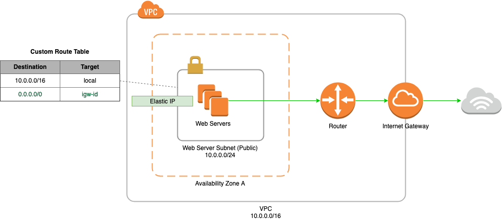

# AWS Scenario 1 - VPC With Public Subnet

#### Description
The configuration for this scenario includes the following:

* A virtual private cloud (VPC) with a size /16 IPv4 CIDR block (example: 10.0.0.0/16). This provides 65,536 private IPv4 addresses.

* A subnet with a size /24 IPv4 CIDR block (example: 10.0.0.0/24). This provides 256 private IPv4 addresses.

* An Internet gateway. This connects the VPC to the Internet and to other AWS services.

* An instance with a private IPv4 address in the subnet range (example: 10.0.0.6), which enables the instance to communicate with other instances in the VPC, and an Elastic IPv4 address (example: 198.51.100.2), which is a public IPv4 address that enables the instance to be reached from the Internet.

* A custom route table associated with the subnet. The route table entries enable instances in the subnet to use IPv4 to communicate with other instances in the VPC, and to communicate directly over the Internet. A subnet that's associated with a route table that has a route to an Internet gateway is known as a public subnet.

#### Commands
To run the terraform script you need to execute the following command:

`terraform apply`

This will create an execution plan that will tell you what resources will be created. It will than prompt you for a y/n to confirm whether you want to apply the execution plan.

To destroy you VPC you must run the following command:

`terraform destroy`

If you would like to see a list of the outputs as a result of running the script you can use the following command:

`terraform output`

If you want to see a human readable output of the terraform state file you can run the following:

`terraform show`
