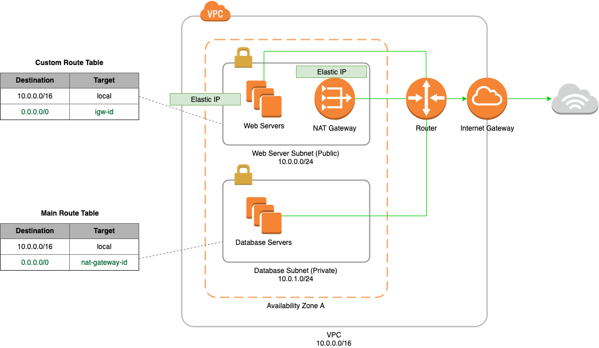

#AWS Scenario 2 - VPC With Public/Private Subnet

####Description
* A VPC with a size /16 IPv4 CIDR block

* A public subnet with a size /24 IPv4 CIDR block (example: 10.0.0.0/24). A public subnet is a subnet that's associated with a route table that has a route to an Internet gateway.

* A private subnet with a size /24 IPv4 CIDR block (example: 10.0.1.0/24).

* An Internet gateway. This connects the VPC to the Internet and to other AWS services.

* Instances with private IPv4 addresses in the subnet range (examples: 10.0.0.5, 10.0.1.5). This enables them to communicate with each other and other instances in the VPC.

* Instances in the public subnet with Elastic IPv4 addresses (example: 198.51.100.1), which are public IPv4 addresses that enable them to be reached from the Internet. The instances can have public IP addresses assigned at launch instead of Elastic IP addresses. Instances in the private subnet are back-end servers that don't need to accept incoming traffic from the Internet and therefore do not have public IP addresses; however, they can send requests to the Internet using the NAT gateway (see the next bullet).

* A NAT gateway with its own Elastic IPv4 address. Instances in the private subnet can send requests to the Internet through the NAT gateway over IPv4 (for example, for software updates).

* A custom route table associated with the public subnet. This route table contains an entry that enables instances in the subnet to communicate with other instances in the VPC over IPv4, and an entry that enables instances in the subnet to communicate directly with the Internet over IPv4.

* The main route table associated with the private subnet. The route table contains an entry that enables instances in the subnet to communicate with other instances in the VPC over IPv4, and an entry that enables instances in the subnet to communicate with the Internet through the NAT gateway over IPv4.

####SSH Connection
In order to connect to the boxes in the private subnet you must first ssh onto the public subnet boxes. To do this you must use ssh agent forwarding. There are a few steps to doing this.

Firstly you must add the agencies to the ssh-agent. To check which identities are already you must run the following command:

`ssh-add -l`

then add your key with the following command

`ssh-add ~/.ssh/yourkey.pem`

to remove all your identities you can run the following command

`ssh-add -D`

The next thing you need to do is connect using agent forwarding. This can be done with the following:

`ssh -A username@hostname`