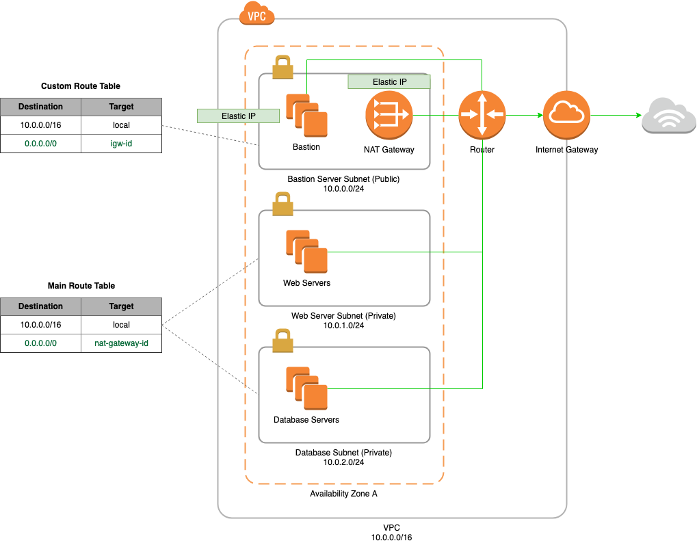

# AWS Scenario 3 - VPC With Public/Private Subnet

#### Description
* A VPC with a size /16 IPv4 CIDR block

* A public subnet with a size /24 IPv4 CIDR block (example: 10.0.0.0/24).

* Two private subnets with a size /24 IPv4 CIDR block (example: 10.0.1.0/24).

* An Internet gateway. This connects the VPC to the Internet and to other AWS services.

* An instance (bastion) in the public subnet with Elastic IPv4 addresses (example: 198.51.100.1), which are public IPv4 addresses that enable them to be reached from the Internet. 

* Instances with private IPv4 addresses in the subnet range (examples: 10.0.0.5, 10.0.1.5). 

* A NAT gateway with its own Elastic IPv4 address. 

* A custom route table associated with the public subnet. 

* The main route table associated with the private subnet.